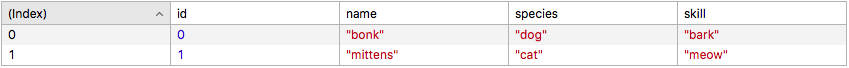

# Series.js
#### *Data processing and manipulation tools for Javascript.*

The `Series` object class extends the `Array prototype`. It inherits all the native Array methods, while providing some additional functionality that may be found in other data processing tools such as python pandas, R, and SQL.

<br>

## Usage

##### Contents:
1. **[Creating a Series object](#create_series_object)** <br>
2. **[Data formats](#data_formats)** <br>
3. **[Static Methods](#static_methods)** <br>
   [.from](#from) <br>
   [.export](#export) <br>
   [.json](#json) <br>

4. **[Series Properties](#series_properties)** <br>
   [.col](#col) <br>
   [.count](#count) <br>
   [.delete](#delete) <br>
   [.left](#left) <br>
   [.right](#right) <br>

5. **[Series Object Methods](#series_object_method)** <br>
   [.all](#all) <br>
   [.avg](#avg) <br>
   [.clone](#clone) <br>
   [.column](#column) <br>
   [.columns](#columns) <br>
   [.deepcopy](#deepcopy) <br>
   [.diff](#diff) <br>
   [.duplicates](#duplicates) <br>
   [.equal](#equal) <br>
   [.fillin](#fillin) <br>
   [.get](#get) <br>
   [.groupby](#groupby) <br>
   [.has](#has) <br>
   [.intersect](#intersect) <br>
   [.numeric](#numeric) <br>
   [.last](#last) <br>
   [.limit](#limit) <br>
   [.max](#max) <br>
   [.merge](#merge) <br>
   [.min](#min) <br>
   [.null](#null) <br>
   [.orderby](#orderby) <br>
   [.partly](#partly) <br>
   [.range](#range) <br>
   [.rename](#rename) <br>
   [.resolve](#resolve) <br>
   [.row](#row) <br>
   [.segment](#segment) <br>
   [.select](#select) <br>
   [.show](#show) <br>
   [.shuffle](#shuffle) <br>
   [.sum](#sum) <br>
   [.top](#top) <br>
   [.typeof](#typeof) <br>
   [.unique](#unique) <br>
   [.where](#where) <br>

<br>

---

### **Creating a Series Object**
```javascript

var series = new Series(['hello world']);

series instanceof Series // true
series instanceof Array  // true
```
<br>

---

### **Data Formats**
<a name="data_formats"></a>
The Series object can accept multi-dimentional data in the following three formats and their respective json string represenations. The Series object natively represents data as an array of objects, where the object keys stand in for the columns found in a tabluar data format.

Therefore, the following tabular data



would be represented as:
```javascript
[
    { "id": 0, "name": "bonk",    "species": "dog", "skill": "bark" },
    { "id": 1, "name": "mittens", "species": "cat", "skill": "meow" }
]
```
<br>

The same dataset can be described as an object with *columns* and *rows* properties.
```javascript
{
    "columns" : [ "id", "name", "species", "skill" ],
    "rows"    : [
        [0, "bonk", "dog", "bark"],
        [1, "mittens", "cat", "meow"]
    ]
}
```
<br>

Or as a multidimentional array, where the first row represents the column names.
```javascript
[
    ["id", "name", "species", "skill"]
    [0, "bonk", "dog", "bark"]
    [1, "mittens", "cat", "meow"]
]
```
The first format can be directly fed into a `new Series()` call. The three formats, their json string representations, flat arrays, and csv files can be fed into the static method `Series.from()` to create a Series object instance.
<br>
<br>

---

### **Static Methods**
<a name="static_methods"></a>

#### Series.from( *data*, *name* )
<a name="from"></a>
```javascript
var data, animals, data1;

data = [
    { "id": 0, "name": "bonk",    "species": "dog", "skill":"bark" },
    { "id": 1, "name": "mittens", "species": "cat", "skill":"meow" }
];

animals = Series.from(data);

/* or when loading from an external source... */
Series.from('data/data1.json', 'data1');

```
The `Series.from` method will take a javascript object, json string, or an external resource, and create a new instance of a Series object.

> ##### Parameters:
> <dl>
>    <dt>data</dt>
>    <dd>The <em>< data ></em> parameter can be of type object, array, or string <a href="#data_formats">(see section on formats)</a>. When loading a dataset from an external source, this parameter should be a string representing the file path or url for the resource.
>    </dd>
> </dl>
> <dl>
>    <dt>name</dt>
>    <dd>The <em>< name ></em> parameter is only required if an external resource is requested. Once parsed, the data will be assigned to a variable with the name provided.
>    </dd>
> </dl>
>
> ##### Returns:
> *Series Object*
>
<br>


#### Series.export( *series*, *format* )
<a name="export"></a>
```javascript
var animals, exported;

animals = [
    { "id": 0, "name": "bonk",    "species": "dog", "skill":"bark" },
    { "id": 1, "name": "mittens", "species": "cat", "skill":"meow" }
];

exported = Series.export(animals, 'json');  /* output formats: object, array, json, csv */
```

<br>

#### Series.json
<a name="json"></a>
> **Series.json.load( *url*, *assignment* )**
> ```javascript
> var animals;
>
> animals = Series.json.load('http://example.com/zoo/animals.json');
>
> ```
>

> <br>
>
> **Series.json.dump( *series* )**
> ```javascript
> var animals, json;
>
> animals = [
>     { "id": 0, "name": "bonk",    "species": "dog", "skill":"bark" },
>     { "id": 1, "name": "mittens", "species": "cat", "skill":"meow" }
> ];
>
> json = Series.json.dump(animals);
>
> ```

<dl>
    <dt></dt>
    <dd></dd>
</dl>
<br>
<br>
<br>

---

### **Series Object Properties**
<a name="series_properties"></a>

#### Series.prototype.col
<a name="col"></a>
```javascript
```

#### Series.prototype.count
<a name="count"></a>
```javascript
```


#### Series.prototype.delete
<a name="delete"></a>
> ##### Series.prototype.delete.column( )
>  ```javascript
>  ```
> ##### Series.prototype.delete.row( )
>  ```javascript
>  ```
> <br>
>
> ##### Series.prototype.delete.index( )
>  ```javascript
>  ```
> <br>
>
> ##### Series.prototype.delete.where( )
>  ```javascript
>  ```
> <br>
>

#### Series.prototype.left
<a name="left"></a>
> ##### Series.prototype.left.merge( )
>  ```javascript
>  ```
> <br>
>

#### Series.prototype.right
<a name="right"></a>
> ##### Series.prototype.right.merge( )
>  ```javascript
>  ```
> <br>
>

<br>
<br>

---

### **Series Object Methods**
<a name="series_object_methods"></a>

####  Series.prototype.all( *condition* )
<a name="all"></a>
```javascript

```
<dl>
    <dt>condition</dt>
    <dd>The data parameter</dd>
</dl>
<br>


<br>

####  Series.prototype.avg( *column* )
<a name="avg"></a>
```javascript

```
<br>
<dl>
    <dt></dt>
    <dd></dd>
</dl>
<br>
<br>

####  Series.prototype.clone( )
<a name="clone"></a>
```javascript

```
<br>

####  Series.prototype.column( *name* )
<a name="column"></a>
```javascript

```
<br>
<dl>
    <dt></dt>
    <dd></dd>
</dl>
<br>
<br>

####  Series.prototype.columns( *order* )
<a name="columns"></a>
```javascript

```
<br>
<dl>
    <dt></dt>
    <dd></dd>
</dl>
<br>
<br>

####  Series.prototype.deepcopy( )
<a name=""></a>
```javascript

```
<br>
<dl>
    <dt></dt>
    <dd></dd>
</dl>
<br>
<br>

####  Series.prototype.diff( )
<a name="diff"></a>
```javascript

```
<br>
<dl>
    <dt></dt>
    <dd></dd>
</dl>
<br>
<br>

####  Series.prototype.duplices( )
<a name="duplicates"></a>
```javascript

```
<br>
<dl>
    <dt></dt>
    <dd></dd>
</dl>
<br>
<br>

####  Series.prototype.equal( )
<a name="equal"></a>
```javascript

```
<br>
<dl>
    <dt></dt>
    <dd></dd>
</dl>
<br>
<br>

####  Series.prototype.fill( )
<a name="fill"></a>
```javascript

```
<br>
<dl>
    <dt></dt>
    <dd></dd>
</dl>
<br>
<br>

####  Series.prototype.get( )
<a name="get"></a>
```javascript

```
<br>
<dl>
    <dt></dt>
    <dd></dd>
</dl>
<br>
<br>

####  Series.prototype.group( )
<a name="group"></a>
```javascript

```
<br>
<dl>
    <dt></dt>
    <dd></dd>
</dl>
<br>
<br>

####  Series.prototype.has( )
<a name="has"></a>
```javascript

```
<br>
<dl>
    <dt></dt>
    <dd></dd>
</dl>
<br>
<br>

####  Series.prototype.intersect( )
<a name="intersect"></a>
```javascript

```
<br>
<dl>
    <dt></dt>
    <dd></dd>
</dl>
<br>
<br>

####  Series.prototype.numeric( )
<a name="numeric"></a>
```javascript

```
<br>
<dl>
    <dt></dt>
    <dd></dd>
</dl>
<br>
<br>

####  Series.prototype.last( )
<a name=""></a>
```javascript

```
<br>
<dl>
    <dt></dt>
    <dd></dd>
</dl>
<br>
<br>

####  Series.prototype.limit( )
<a name=""></a>
```javascript

```
<br>
<dl>
    <dt></dt>
    <dd></dd>
</dl>
<br>
<br>

####  Series.prototype.max( )
<a name=""></a>
```javascript

```
<br>
<dl>
    <dt></dt>
    <dd></dd>
</dl>
<br>
<br>

####  Series.prototype.merge( )
<a name=""></a>
```javascript

```
<br>
<dl>
    <dt></dt>
    <dd></dd>
</dl>
<br>
<br>

####  Series.prototype.min( )
<a name=""></a>
```javascript

```
<br>
<dl>
    <dt></dt>
    <dd></dd>
</dl>
<br>
<br>

####  Series.prototype.null( )
<a name=""></a>
```javascript

```
<br>
<dl>
    <dt></dt>
    <dd></dd>
</dl>
<br>
<br>

####  Series.prototype.orderby( )
<a name=""></a>
```javascript

```
<br>
<dl>
    <dt></dt>
    <dd></dd>
</dl>
<br>
<br>

####  Series.prototype.partly( )
<a name=""></a>
```javascript

```
<br>
<dl>
    <dt></dt>
    <dd></dd>
</dl>
<br>
<br>

####  Series.prototype.range( )
<a name=""></a>
```javascript

```
<br>
<dl>
    <dt></dt>
    <dd></dd>
</dl>
<br>
<br>

####  Series.prototype.rename( )
<a name=""></a>
```javascript

```
<br>
<dl>
    <dt></dt>
    <dd></dd>
</dl>
<br>
<br>

####  Series.prototype.resolve( )
<a name=""></a>
```javascript

```
<br>
<dl>
    <dt></dt>
    <dd></dd>
</dl>
<br>
<br>

####  Series.prototype.row( )
<a name=""></a>
```javascript

```
<br>
<dl>
    <dt></dt>
    <dd></dd>
</dl>
<br>
<br>

####  Series.prototype.segment( )
<a name=""></a>
```javascript

```
<br>
<dl>
    <dt></dt>
    <dd></dd>
</dl>
<br>
<br>

####  Series.prototype.select( )
<a name=""></a>
```javascript

```
<br>
<dl>
    <dt></dt>
    <dd></dd>
</dl>
<br>
<br>

####  Series.prototype.show( )
<a name=""></a>
```javascript

```
<br>
<dl>
    <dt></dt>
    <dd></dd>
</dl>
<br>
<br>

####  Series.prototype.shuffle( )
<a name=""></a>
```javascript

```
<br>
<dl>
    <dt></dt>
    <dd></dd>
</dl>
<br>
<br>

####  Series.prototype.sum( )
<a name=""></a>
```javascript

```
<br>
<dl>
    <dt></dt>
    <dd></dd>
</dl>
<br>
<br>

####  Series.prototype.top( )
<a name=""></a>
```javascript

```
<br>
<dl>
    <dt></dt>
    <dd></dd>
</dl>
<br>
<br>

####  Series.prototype.typeof( )
<a name=""></a>
```javascript

```
<br>
<dl>
    <dt></dt>
    <dd></dd>
</dl>
<br>
<br>

####  Series.prototype.unique( )
<a name=""></a>
```javascript

```
<br>
<dl>
    <dt></dt>
    <dd></dd>
</dl>
<br>
<br>

####  Series.prototype.where( )
<a name=""></a>
```javascript

```
<br>
<dl>
    <dt></dt>
    <dd></dd>
</dl>
<br>
<br>
<br>